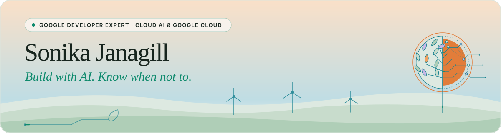

### Hi, I'm [Sonika](https://sonikajanagill.com/) 👋 
**Google Developer Expert (GDE) in Cloud AI and Google Cloud**  
Lead Backend Engineer at VML · Data/MLOps Engineer 
Watford, UK

  

## 🌐 Socials:
   
 

## What I work on

 
I build production AI systems at the intersection of ecommerce and Google Cloud, also as my GDE focus. My current projects span agentic commerce protocols (UCP, ACP, MCP), MLOps on Vertex AI, and enterprise agent architectures.
 
**Day job:** On MLOps platform on Vertex AI, a Large Marketing Model trained on real-time signals, and an activation layer across channels and clouds.
 
**Tech community work:** Running the VML AI Guild (250+ engineers across six countries), leading the Women Coding Community AI Learning Series, and building POCs at the edge of what agent protocols can do in commerce.
 

## Active projects
 
| Project | What it is |
|---|---|
| [agentic-commerce](https://github.com/sonikajanagill/agentic-commerce) | Multi-protocol commerce server: UCP, ACP, MCP. Buyer and merchant agents, full-duplex checkout via ADK. |
| [Prism](https://github.com/sonikajanagill/prism) | AI Article Agent for GDE thought leadership. Multi-agent ADK system: scouts, researches, and recommends article topics using a 3-tier content strategy framework. |
| AgentSkills | Enterprise agent skills repo for VML AI SDLC workflows. |
| Arch-Lens | Multimodal architecture diagram tool. |

 
 
## Writing
 
I write about agentic commerce, Vertex AI, and Google Cloud for the [Google Cloud Community on Medium](https://medium.sonikajanagill.com).
 
Recent and ongoing series:
 
- **Agentic Commerce on Google Cloud** — Gemma 4, ADK, UCP, AP2, A2A end to end
- **MLOps at Scale on Vertex AI** — KFP v2, federated data, LMM training
 
All articles are published first at [sonikajanagill.com](https://sonikajanagill.com) with canonicals to Medium, Dev.to, and Hackernoon.
 
 

## Stack
| Stack | Technologies|
|---|---|
| AI/ML |  ·  ·  ·  ·  ·  ·  ·  |
| Commerce | UCP · AP2 · A2A · MCP · Shopify MCP · Merchant Centre |
| Cloud |  ·  ·  |
| Backend |  ·  · Spring Boot · Node.js · Terraform |
| Data | BigQuery · Dataproc · Cloud Composer |
| Certs | GCP Professional Architect · GCP Professional ML Engineer · Google Generative AI Leader|
 
 
 
## Community
 
- **Google Developer Expert** — Cloud AI and Google Cloud (March 2026)
- **VML AI Guild** — knowledge sharing across 250+ engineers in 6 countries
- **Women Coding Community** — leading the AI Learning Series
- **GDG London** — speaker and community member
- **ADK Community Calls** — monthly, via Google invitation
 
 

## 🎓 Certifications:
  

# 📊 GitHub Stats:
<picture>
  <source media="(prefers-color-scheme: dark)" srcset="https://github-readme-stats.vercel.app/api?username=sonikajanagill&hide_border=false&include_all_commits=false&count_private=false&title_color=4FC3A1&icon_color=5FB7C4&text_color=9AB0A4&bg_color=1A2A22&border_color=26382E" />
  <source media="(prefers-color-scheme: light)" srcset="https://github-readme-stats.vercel.app/api?username=sonikajanagill&hide_border=false&include_all_commits=false&count_private=false&title_color=0F8A6D&icon_color=16808F&text_color=4E6459&bg_color=FFFFFF&border_color=DCE5DD" />
  
</picture>
 
<picture>
  <source media="(prefers-color-scheme: dark)" srcset="https://github-readme-streak-stats.herokuapp.com/?user=sonikajanagill&hide_border=false&background=1A2A22&border=26382E&stroke=26382E&ring=4FC3A1&fire=F2A05F&currStreakNum=E4EEE8&sideNums=E4EEE8&currStreakLabel=4FC3A1&sideLabels=9AB0A4&dates=9AB0A4" />
  <source media="(prefers-color-scheme: light)" srcset="https://github-readme-streak-stats.herokuapp.com/?user=sonikajanagill&hide_border=false&background=FFFFFF&border=DCE5DD&stroke=DCE5DD&ring=0F8A6D&fire=F2A05F&currStreakNum=17251E&sideNums=17251E&currStreakLabel=0F8A6D&sideLabels=4E6459&dates=4E6459" />
  
</picture>
 
<picture>
  <source media="(prefers-color-scheme: dark)" srcset="https://github-readme-stats.vercel.app/api/top-langs/?username=sonikajanagill&hide_border=false&include_all_commits=false&count_private=false&layout=compact&title_color=4FC3A1&text_color=9AB0A4&bg_color=1A2A22&border_color=26382E" />
  <source media="(prefers-color-scheme: light)" srcset="https://github-readme-stats.vercel.app/api/top-langs/?username=sonikajanagill&hide_border=false&include_all_commits=false&count_private=false&layout=compact&title_color=0F8A6D&text_color=4E6459&bg_color=FFFFFF&border_color=DCE5DD" />
  
</picture>

 

  
#### ⭐ "Sharing knowledge that's 80% good today is better than waiting for 100% perfection tomorrow"

 
